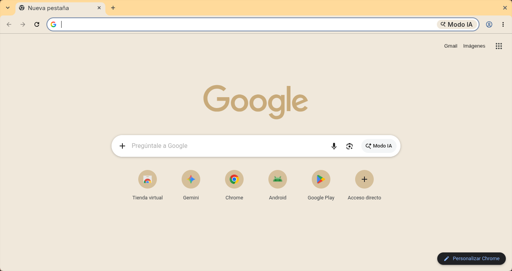

# Minimalist Cornmeal Porridge

A minimal Chrome theme in a warm, golden palette, by Miguel Euraque.

A warm golden frame, a pale cream toolbar and new tab page, and black text for contrast. It is the soft corn-yellow of cooked cornmeal porridge, kept bright but not glaring.

## Features

- **Palette:** golden frame, cream surfaces, black text
- **Minimalist design:** clean and uncluttered
- **Easy installation:** Chrome Manifest V3
- **Gentle on the eyes:** low-contrast colors that stay easy to read

## Installation

### Chrome Web Store (recommended)

1. Visit the [Minimalist Cornmeal Porridge](https://chromewebstore.google.com/detail/minimalist-cornmeal-porri/ogmppdneagohicjdgpakkpjbkabgkcea) page in the Chrome Web Store.
2. Click **Add to Chrome**.

### From source

1. Clone this repository.
2. Open `chrome://extensions` and turn on Developer mode.
3. Click **Load unpacked** and select the theme folder.
